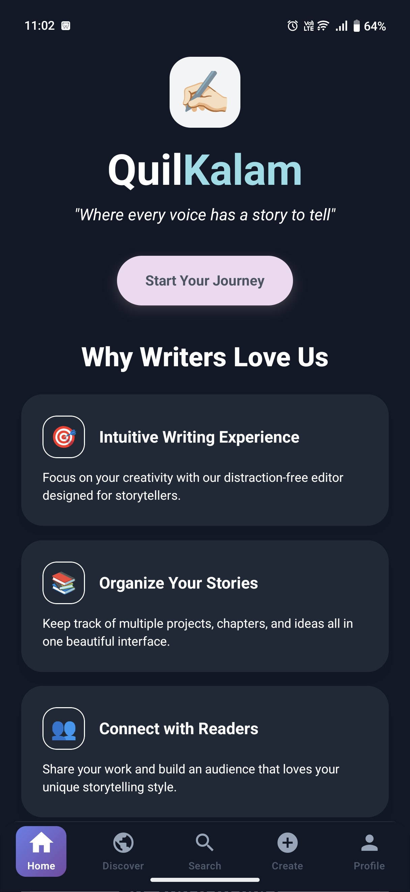
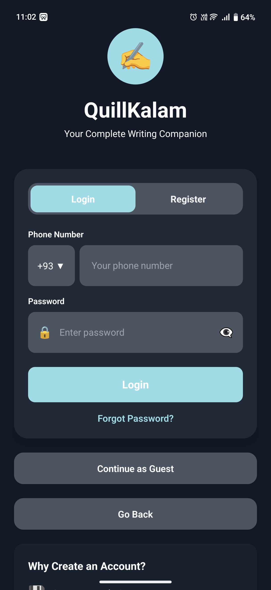

# QuilKalam Mobile App

<p align="center">
  
</p>

<p align="center">
  <strong>A modern, distraction-free writing platform for mobile</strong>
</p>

<p align="center">
  <a href="https://github.com/Badsha1996/quil-kalam-mobile-app/blob/main/LICENSE">
    
  </a>
  <a href="https://github.com/Badsha1996/quil-kalam-mobile-app/releases">
    
  </a>
  <a href="https://github.com/Badsha1996/quil-kalam-mobile-app/stargazers">
    
  </a>
</p>

---

## 📥 Downloads

| Platform                           | Link                                                                                                                                                                                                                                    |
| ---------------------------------- | --------------------------------------------------------------------------------------------------------------------------------------------------------------------------------------------------------------------------------------- |
| **Google Play (Early Access)**     | [](https://play.google.com/store/apps/details?id=com.quilkalam.myapp)                                                                            |
| **Google Play (Internal Testing)** | [](https://play.google.com/apps/test/RQ3AyTU3HZg/ahAO29uNRZJdr7wAizQ4URGRj11jf0tCaShMYgEu4xXNtYtMVbJYe7RdqPbCfxllGdY5VVXVxHhnStjGhh3u7cqzc3) |
| **Latest Release APK**             | [](https://github.com/Badsha1996/quil-kalam-mobile-app/releases/download/quilkalam-v1.2.0/quilkalam.apk)                                                 |

> **Note:** To access early access builds, please join our [QuilKalam Beta Tester](https://groups.google.com/g/quilkalam-beta-tester) group first.

> QuilKalam is a cross-platform mobile application built with **Expo**, **React Native**, **NativeWind**, and **Tailwind CSS**. It provides writers and readers with an intuitive, modern platform to write, organize, and share stories with beautiful animations and responsive design. |

## Screenshots

<p align="center">
  
  
  
</p>

## Features

- ✍️ **Distraction-Free Writing**: Focus on creativity with a clean, minimal editor.
- 📚 **Story Organization**: Manage multiple projects, chapters, and ideas.
- 👥 **Community**: Connect with readers and other writers.
- 🎯 **Smart Tools**: Progress tracking and intelligent suggestions.
- 🎨 **Beautiful UI**: Animated transitions and custom theming with Tailwind CSS.

## Getting Started

### Prerequisites

- [Node.js](https://nodejs.org/) (v18+ recommended)
- [Yarn](https://yarnpkg.com/) or [npm](https://www.npmjs.com/)
- [Expo CLI](https://docs.expo.dev/get-started/installation/):
  ```sh
  npm install -g expo-cli
  ```

### Installation

1. **Clone the repository:**

   ```sh
   git clone https://github.com/your-username/quil-kalam-mobile-app.git
   cd quil-kalam-mobile-app
   ```

2. **Install dependencies:**

   ```sh
   npm install
   # or
   yarn install
   ```

3. **Start the development server:**

   ```sh
   npm run start
   # or
   yarn start
   ```

4. **Run on your device:**
   - For Android: `npm run android`
   - For iOS: `npm run ios`
   - For Web: `npm run web`

---

## Development

- **Code Style:**
  - Uses [ESLint](https://eslint.org/) with Expo config.
  - Tailwind CSS for styling via [NativeWind](https://www.nativewind.dev/).
- **Type Checking:**
  - TypeScript strict mode enabled.
- **Hot Reloading:**
  - Supported via Expo.

### Useful Scripts

| Script                  | Description                   |
| ----------------------- | ----------------------------- |
| `npm run start`         | Start Expo development server |
| `npm run android`       | Run app on Android emulator   |
| `npm run ios`           | Run app on iOS simulator      |
| `npm run web`           | Run app in web browser        |
| `npm run lint`          | Run ESLint checks             |
| `npm run reset-project` | Clean and reset project       |

---

## Configuration

- **Tailwind CSS:**  
  Configured in [`tailwind.config.js`](tailwind.config.js) and [`app/global.css`](app/global.css).
- **Metro Bundler:**  
  Custom config in [`metro.config.js`](metro.config.js) for NativeWind.
- **TypeScript:**  
  Paths and strict mode in [`tsconfig.json`](tsconfig.json).

---

## Folder Details

- [`app/`](app): Main application screens and navigation.
- [`components/`](components): Reusable UI components.
- [`assets/`](assets): Images and icons.
- [`constants/`](constants): Shared constants (e.g., icon definitions).
- [`types/`](types): TypeScript type definitions.

---

## Contributing

1. Fork the repository.
2. Create your feature branch: `git checkout -b feature/your-feature`
3. Commit your changes: `git commit -am 'Add some feature'`
4. Push to the branch: `git push origin feature/your-feature`
5. Open a pull request.

---

## License

This project is licensed under the MIT License.

---

## Acknowledgements

- [Expo](https://expo.dev/)
- [React Native](https://reactnative.dev/)
- [NativeWind](https://www.nativewind.dev/)
- [Tailwind CSS](https://tailwindcss.com/)
